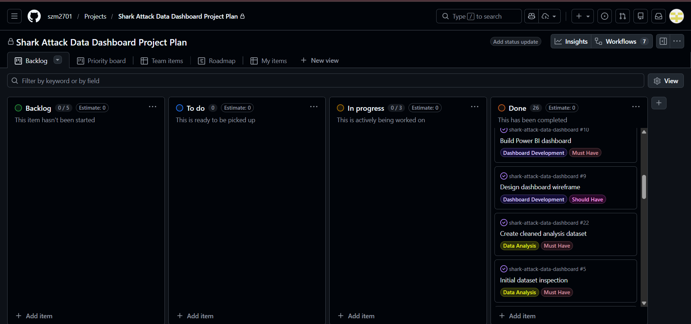
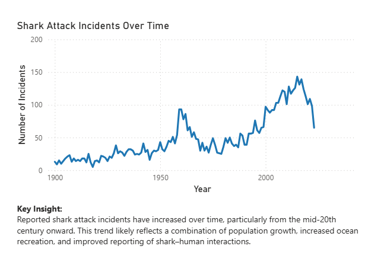
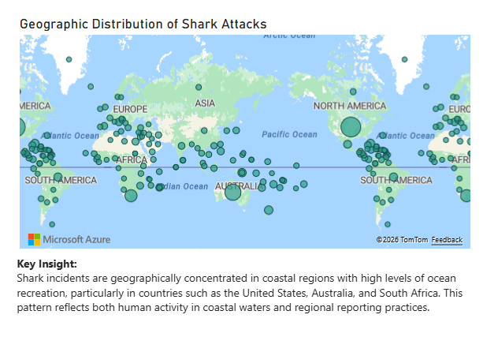
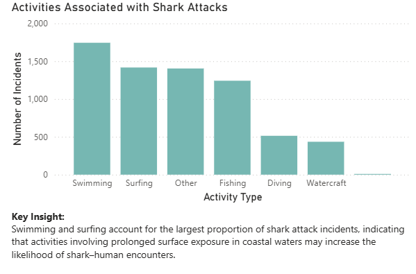
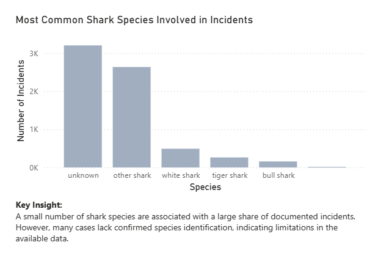
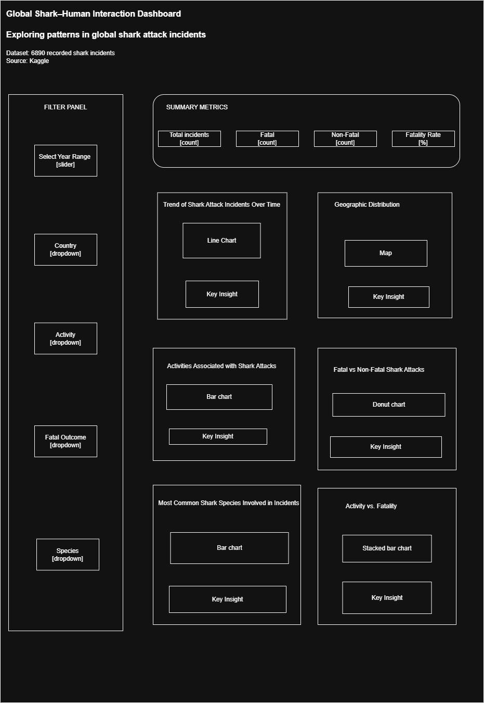
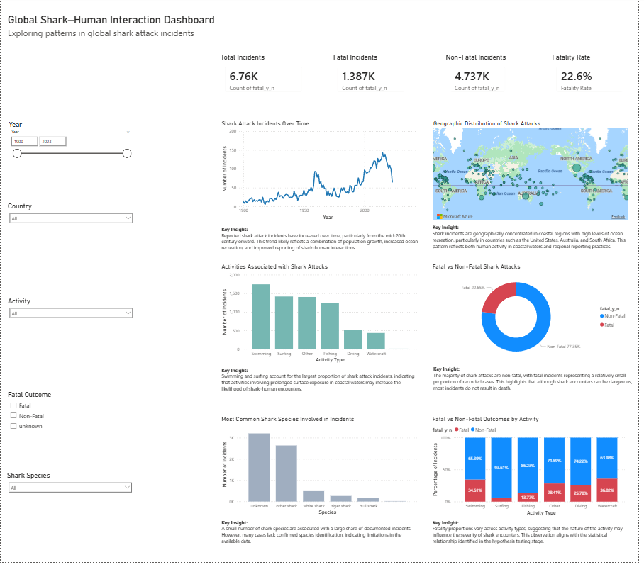

# 

<a name="top"></a>

# Global Shark–Human Interaction Analysis


## Project Summary

This project analyses global shark attack incidents using Python and Power BI to identify patterns in shark–human interactions across time, location, activity type, and species involvement.

---

## Table of Contents

- [Project Overview](#project-overview)
- [Project Highlights](#project-highlights)
- [Project Motivation](#project-motivation)
- [Dataset](#dataset)
- [Project Objectives](#project-objectives)
- [Research Questions](#research-questions)
- [Project Workflow](#project-workflow)
- [Methodology](#methodology)
- [Hypotheses Testing and Analytical Findings](#hypotheses-testing-and-analytical-findings)
- [Development Roadmap](#development-roadmap)
- [Visualisations Preview](#visualisations-preview)
- [Live Dashboard](#live-dashboard)
- [Dashboard](#dashboard)
- [Key Findings](#key-findings)
- [Ethical Considerations](#ethical-considerations)
- [Limitations](#limitations)
- [Future Work](#future-work)
- [Technologies Used](#technologies-used)
- [Use of Generative AI](#use-of-generative-artificial-intelligence-genai)
- [Learning Journey](#learning-journey)
- [Repository Structure](#repository-structure)
- [Folder Description](#folder-description)
- [How to Run the Project](#how-to-run-the-project)
- [Key Project Outputs](#key-project-outputs)
- [Author](#author)
- [References](#references)

---

## Project Overview

This project analyses global shark attack incidents to identify patterns in shark–human interactions across time, location, activity type, and shark species.

Using historical incident records, the analysis explores trends in shark encounters and examines factors associated with fatal and non-fatal outcomes. The project combines data cleaning, exploratory data analysis, statistical testing, and interactive dashboard visualisation to provide insights into how and where shark–human interactions occur.

The results are presented through an interactive Power BI dashboard that allows users to explore shark attack data dynamically.

[Back to top](#top)

---

## Project Highlights

• Analysed **6,800+ global shark attack records** to identify patterns in shark–human interactions.

• Applied **data cleaning and feature engineering** techniques using Python and Pandas.

• Conducted **statistical hypothesis testing (Chi-square test)** to evaluate the relationship between human activity and fatality outcomes.

• Built an **interactive Power BI dashboard** enabling users to explore shark attack trends by time, location, activity type, and species.

• Addressed **ethical considerations and reporting bias** when analysing wildlife incident data.

• Demonstrated the **end-to-end data analytics workflow**, from raw data preparation to interactive visualisation.

---

## Project Motivation

Shark attacks are rare events but receive significant media attention and often shape public perception of sharks and ocean safety. Understanding the patterns behind these incidents can help contextualise risk and highlight the environmental and behavioural factors that contribute to shark–human encounters.

This project applies data analytics techniques to examine historical shark attack records and provide a data-driven perspective on global shark–human interactions.

---

## Dataset

The dataset used in this project is the **Global Shark Attack Dataset**, obtained from Kaggle:

https://www.kaggle.com/datasets/gauravkumar2525/shark-attacks

The dataset contains historical records of shark attack incidents worldwide and includes information such as:

- Incident year and date  
- Country and geographic location  
- Activity performed by the victim  
- Shark species (where identified)  
- Fatal or non-fatal outcome  

Prior to analysis, the dataset was cleaned and processed to address missing values, inconsistent formatting, and categorical standardisation.

[Back to top](#top)

---

## Project Objectives

The main objectives of this project were to:

- Analyse temporal trends in shark attack incidents  
- Identify geographic patterns in shark–human interactions  
- Examine activities associated with shark attack incidents  
- Investigate the distribution of fatal versus non-fatal outcomes  
- Analyse shark species involvement in reported incidents  
- Explore the relationship between activity type and fatality outcome  
- Develop an interactive dashboard to visualise shark attack patterns  

---

## Research Questions

This project investigates several analytical questions relating to shark–human interactions:

- How have shark attack incidents changed over time globally?
- Which geographic regions report the highest number of incidents?
- What human activities are most frequently associated with shark attacks?
- Which shark species are most commonly involved in incidents?
- Is there a statistical relationship between activity type and fatality outcome?

---

## Project Workflow

This project follows a structured data analytics pipeline, progressing from raw dataset exploration to cleaned analytical datasets, statistical testing, and interactive dashboard visualisation.

The workflow includes the following stages:

1. **Data Collection**

   The shark attack dataset was obtained from Kaggle and inspected to understand the structure, variables, and missing values.

2. **Data Preparation**

   Raw data was cleaned and standardised to ensure consistency across variables such as activity type, shark species, and fatality outcomes.

3. **Exploratory Data Analysis**

   Descriptive statistics and visualisations were used to explore temporal trends, geographic distribution, and activity patterns associated with shark attacks.

4. **Statistical Analysis**

   A Chi-square test of independence was conducted to examine the relationship between activity type and fatality outcome.

5. **Dashboard Development**

   Analytical findings were communicated through an interactive Power BI dashboard designed to allow users to explore trends in shark–human interactions.

---

## Methodology

The project followed a structured data analytics workflow consisting of the following stages.

### Data Preparation

- Loading the dataset  
- Inspecting dataset structure and variables  

### Data Cleaning and Feature Engineering

- Handling missing and inconsistent values  
- Standardising categorical variables  
- Creating derived variables for analysis  

### Exploratory Data Analysis

- Descriptive statistics  
- Visual exploration of patterns and trends  

### Statistical Analysis

- Chi-square hypothesis testing to investigate the relationship between activity type and fatality outcome  

### Dashboard Development

- Creation of an interactive Power BI dashboard to visualise key insights  

[Back to top](#top)

---

## Hypotheses Testing and Analytical Findings

The following hypotheses were developed to examine key patterns in the shark attack dataset. These hypotheses focus on geographic distribution, the relationship between human activity and fatality outcomes, overall fatality proportions, and temporal trends in recorded incidents.

Together, these hypotheses allow the analysis to move beyond descriptive exploration and evaluate whether the observed patterns reflect meaningful relationships within the data.

Where appropriate, statistical tests were applied, while other hypotheses were evaluated through descriptive analysis and visualisation.

### Hypothesis 1 — Country Distribution

H0₁: Shark attack frequency is independent of the country in which the incident occurred.

H1₁: Shark attack frequency varies significantly between countries.

Test Method:  
Descriptive geographic analysis using country-level incident frequencies and visualisation.

Result: Shark attack incidents are concentrated in the United States, Australia, and South Africa, supporting H1₁.

### Hypothesis 2 — Activity and Fatality Outcome

H0₂: Fatality outcome is independent of the activity being performed during the shark attack incident.

H1₂: Fatality outcome is associated with the activity being performed.

Test Method:  
Chi-square test of independence.

Result: χ² = 452.96, df = 5, p < 0.001 - H1₂ supported.

### Hypothesis 3 — Fatal vs Non-Fatal Proportion

H0₃: The proportion of fatal shark attacks is equal to the proportion of non-fatal shark attacks.

H1₃: The proportion of non-fatal shark attacks is greater than the proportion of fatal shark attacks.

Test Method:  
Proportion comparison using descriptive statistics.

Result: Non-fatal incidents greatly exceed fatal incidents - H1₃ supported.

### Hypothesis 4 — Temporal Trends

H0₄: The number of recorded shark attack incidents has remained constant over time.

H1₄: The number of recorded shark attack incidents has increased over time.

Test Method:
Trend analysis using descriptive statistics and visual inspection.

Result: Recorded shark attack incidents show an increasing trend in recent decades, supporting H1₄.

---

## Development Roadmap

Project development was organised using a **GitHub Project Board** following a Kanban-style workflow.  
Tasks were organised into stages including **Backlog**, **To Do**, **In Progress**, and **Done**, allowing progress to be tracked throughout the project lifecycle.

The board was used to manage key project tasks including:

- Dataset exploration and inspection
- Data cleaning and preprocessing
- Feature engineering and dataset preparation
- Exploratory data analysis and visualisation
- Statistical hypothesis testing
- Dashboard wireframe design
- Power BI dashboard development
- Documentation and project reporting

### Project Board



You can view the live project board here:

**GitHub Project Board:**  
https://github.com/szm2701/shark-attack-data-dashboard/projects

The Kanban board ensured that the project followed a structured development process, helping to organise analytical tasks, monitor progress, and maintain clear separation between different stages of the project workflow.

---

## Visualisations Preview

Example visualisations generated during the analysis.

### Incidents Over Time



### Geographic Distribution of Shark Attacks



### Activities Associated with Shark Attacks



### Shark Species Involved



---

## Live Dashboard

The dashboard allows users to interactively explore global shark attack trends through filtering by year, country, activity type, shark species, and fatality outcome.

The interactive Power BI dashboard can be viewed here:

**View the live dashboard:**  
[Open Power BI Dashboard](https://app.powerbi.com/view?r=eyJrIjoiNjY2NmVlNzYtYjNmNS00NzFiLTgxYjItYTQzN2U5NTA5YjBkIiwidCI6ImMyMzNjMDcyLTEzNWItNDMxZC1hZjU5LTM1ZTA1YmFiZjk0MSIsImMiOjh9)

---

## Dashboard

An interactive **Power BI dashboard** was developed to present the analytical findings and allow users to explore shark attack data dynamically.

The dashboard includes visualisations for:

- Shark attack incidents over time  
- Geographic distribution of incidents  
- Activities associated with shark attacks  
- Fatal vs non-fatal outcomes  
- Shark species involved in incidents  
- Activity type vs fatality outcome  

### Dashboard Features

The Power BI dashboard includes several interactive features that allow users to explore the dataset dynamically:

- Year range filtering
- Country selection
- Activity type filtering
- Shark species exploration
- Fatal vs non-fatal incident comparison
- Interactive geographic visualisation

These filters allow users to investigate how shark–human interaction patterns vary across time, location, and activity.

### Dashboard Wireframe

Before building the final dashboard, a wireframe was created to plan the layout and placement of visualisations.



### Dashboard Preview



[Back to top](#top)

---

## Key Findings

The analysis revealed several key insights:

- Recorded shark attack incidents have increased over time, likely reflecting increased human activity in coastal environments and improved reporting.  
- Shark attacks are concentrated in coastal regions with high levels of ocean recreation, particularly in the United States, Australia, and South Africa.  
- Swimming and surfing are among the activities most commonly associated with shark attack incidents.  
- The majority of recorded shark attacks are non-fatal, indicating that while incidents occur, fatal outcomes are comparatively rare.
- Chi-square testing identified a statistically significant relationship between activity type and fatality outcome. 

Overall, the findings highlight that shark–human interactions are influenced by patterns of human activity and coastal recreation, and that while incidents occur globally, fatal outcomes remain relatively rare. These insights emphasise the importance of interpreting shark attack data carefully and avoiding exaggerated perceptions of risk.

[Back to top](#top)

---

## Ethical Considerations

Although the dataset does not contain personally identifiable information, ethical considerations were addressed throughout the project.

Responsible data handling practices were followed, and relevant frameworks such as the **General Data Protection Regulation (GDPR)** and guidance from the **Information Commissioner’s Office (ICO)** were considered when discussing ethical data governance and interpretation.

---

## Limitations

Several limitations affect the analysis:

- Missing or incomplete data in certain fields  
- Many incidents include unidentified shark species  
- Historical reporting bias in older records  
- Lack of environmental variables influencing shark behaviour  
- Predictive modelling was not implemented in this project. Although forecasting techniques could potentially be applied to shark attack incident data, irregular reporting patterns, missing values, and historical inconsistencies in the dataset may limit the reliability of predictive models. The project therefore focuses on descriptive analysis, hypothesis testing, and dashboard-based exploration.

These limitations should be considered when interpreting the results.

---

## Future Work

Future research could extend this project by incorporating environmental variables such as water temperature, ocean currents, seasonal patterns, or prey availability.

More detailed datasets could also support spatial analysis or predictive modelling approaches to better understand the conditions under which shark encounters occur.

---

## Technologies Used

- Python  
- Pandas  
- NumPy  
- Matplotlib  
- Seaborn  
- Jupyter Notebook  
- Power BI  

---

## Use of Generative Artificial Intelligence (GenAI)

Generative AI tools (Microsoft Copilot) were used to support parts of the development workflow.

AI assistance was used for:

- Debugging Python code
- Structuring the project documentation
- Improving written explanations of analytical findings
- Supporting interpretation of visualisations for a non-technical audience

All analytical decisions, statistical testing, and interpretation of results were reviewed and validated independently.

---

## Learning Journey

This project provided an opportunity to apply a complete data analytics workflow to a real-world environmental dataset.

One of the main challenges involved cleaning the historical shark attack dataset, which contained many missing values, inconsistent categorical labels, and incomplete species identification. Standardising activity categories and grouping shark species required careful preprocessing to ensure the dataset could support meaningful analysis.

Another challenge involved interpreting the dataset responsibly. Shark attack data is often sensationalised in media reporting, so it was important to present findings in a way that emphasises the rarity of incidents and avoids reinforcing misconceptions about sharks.

Developing the Power BI dashboard also required iterative design decisions to ensure that visualisations clearly communicated the key insights while remaining easy to interpret for non-technical users.

Overall, this project strengthened skills in data cleaning, exploratory analysis, statistical testing, and dashboard design. It also reinforced the importance of responsible interpretation and communication when analysing environmental and wildlife datasets.

---

## Repository Structure

```
shark-attack-data-dashboard/
│
├── dashboard/
│ └── shark-dashboard.pbix
│
├── data/
│ ├── raw/
│ │ └── shark_attacks.csv
│ │
│ └── processed/
│ └── shark_attacks_cleaned.csv
│
├── images/
│ ├── activities_sharks.png
│ ├── dashboard_final.png
│ ├── donut_fatality.png
│ ├── shark_incidents.png
│ ├── shark_map.png
│ ├── shark-human-dashboard.drawio.png
│ ├── species_chart.png
│ └── stacked_fatality.png
│
├── jupyter_notebooks/
│ └── shark_attack_analysis.ipynb
│
├── outputs/
│ └── figures/
│
├── .gitignore
├── .python-version
├── .slugignore
├── Procfile
├── requirements.txt
├── setup.sh
└── README.md

```
---

### Folder Description

| Folder | Description |
|------|------|
| dashboard | Power BI dashboard file |
| data/raw | Original dataset downloaded from Kaggle |
| data/processed | Cleaned dataset used for analysis |
| images | Visualisations and dashboard screenshots |
| jupyter_notebooks | Main analysis notebook |
| outputs/figures | Exported figures from analysis |

---

## How to Run the Project

1. Clone the repository

```git clone <repository-url>```


2. Navigate to the project folder

3. Install dependencies

```pip install -r requirements.txt```

4. Open the Jupyter Notebook

```jupyter notebook```


5. Run the notebook to reproduce the analysis.

### Reproducibility

All analysis steps are fully reproducible using the included Jupyter notebook.

Running the notebook will:

- Load the raw dataset
- Perform data cleaning and preprocessing
- Generate analytical visualisations
- Conduct statistical hypothesis testing

The processed dataset used by the dashboard is also included in the repository.

---

## Key Project Outputs

The main outputs of this project include:

**Analysis notebook**

`jupyter_notebooks/shark_attack_analysis.ipynb`

**Processed dataset**

`data/processed/shark_attacks_cleaned.csv`

**Visualisations**

`outputs/figures/`

**Power BI dashboard**

`dashboard/shark-dashboard.pbix`

**Dashboard visualisations**

`images/`

---

## Author

Shazia

Data Analytics Capstone Project  
March 2026

---

## References

Dulvy, N. K. et al. (2014). *Extinction risk and conservation of the world’s sharks and rays*. eLife.

European Union. (2016). *General Data Protection Regulation (GDPR)*.

Ferretti, F., Jorgensen, S., Chapple, T., De Leo, G., & Micheli, F. (2015). Reconciling predator conservation with public safety. *Frontiers in Ecology and the Environment*.

Information Commissioner’s Office. (2023). *Guide to data protection*.

Neff, C., & Hueter, R. (2013). Science, policy, and the public discourse of shark “attack”. *Journal of Environmental Studies and Sciences*.

Kumar, G. (2023). *Shark Attacks Dataset*. Kaggle.  
https://www.kaggle.com/datasets/gauravkumar2525/shark-attacks

[Back to top](#top)

---
